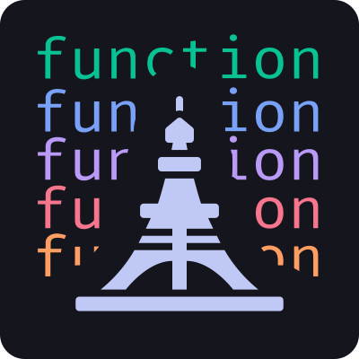

    
    <h1>Tokyo Night for <a href="https://mixplorer.com">MiXplorer</a></h1>
    
    
    

&nbsp;

A clean, dark **MiXplorer** theme that celebrates the lights of Downtown Tokyo at night.

| [Home](https://raw.githubusercontent.com/TheDevilsHyper/MiXplorer/refs/heads/main/images/SS-mix-home.jpg) | Editor |
| ---- | ---- |
|  |  |

## :memo: Usage
1. [Download](https://github.com/TheDevilsHyper/MiXplorer/raw/refs/heads/main/assets/tokyo-night.mit).
2. Import and enjoy.

## :busts_in_silhouette: Maintainers
|  |  |  
| --------------------------------------------------------------------------------------------- | --------------------------------------------------------------------------------------------- |
| [Tokyo Night](https://github.com/tokyo-night)                                                 | [TheDevilsHyper](https://github.com/TheDevilsHyper) |
